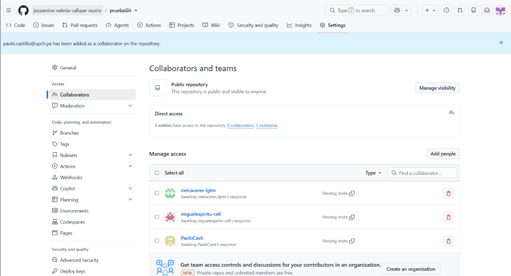
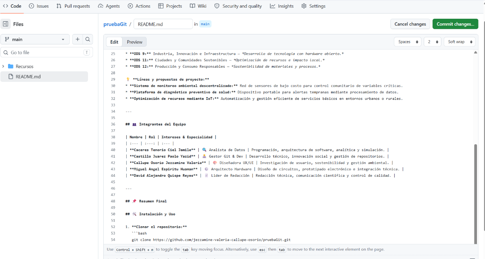
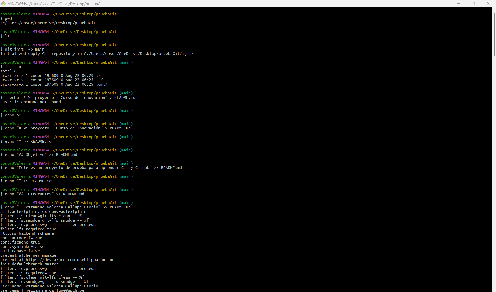
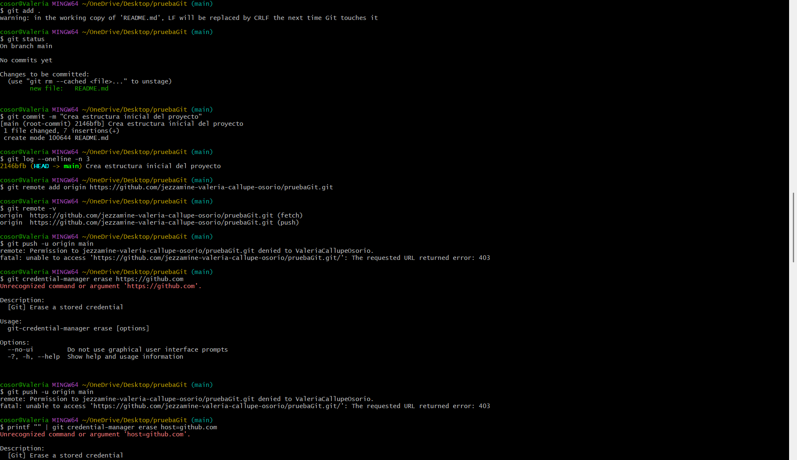
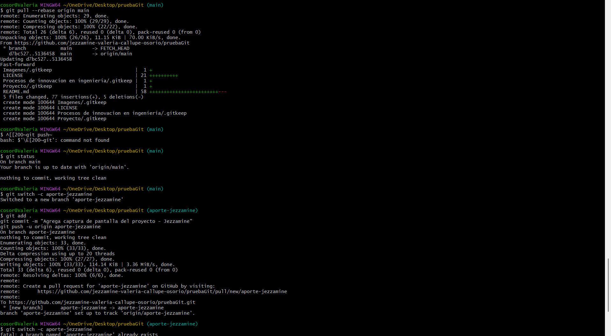
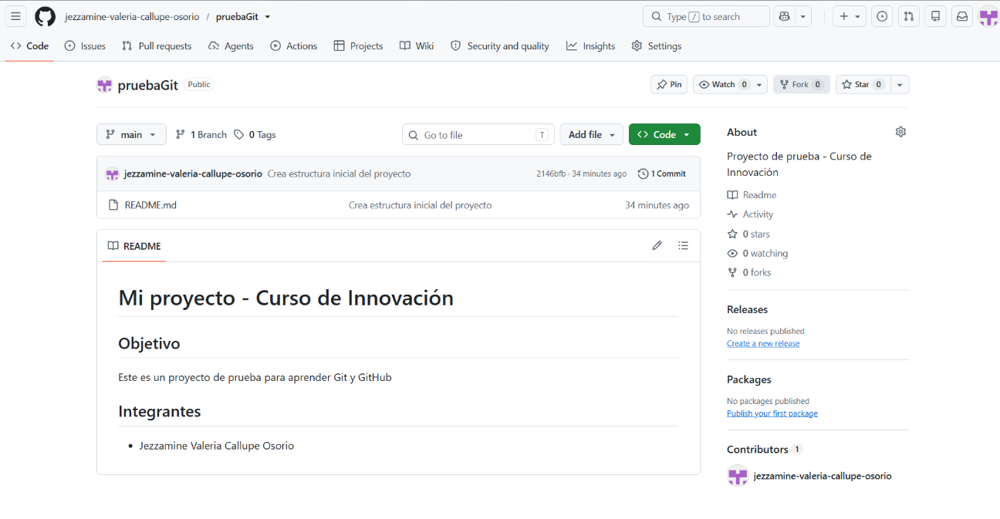
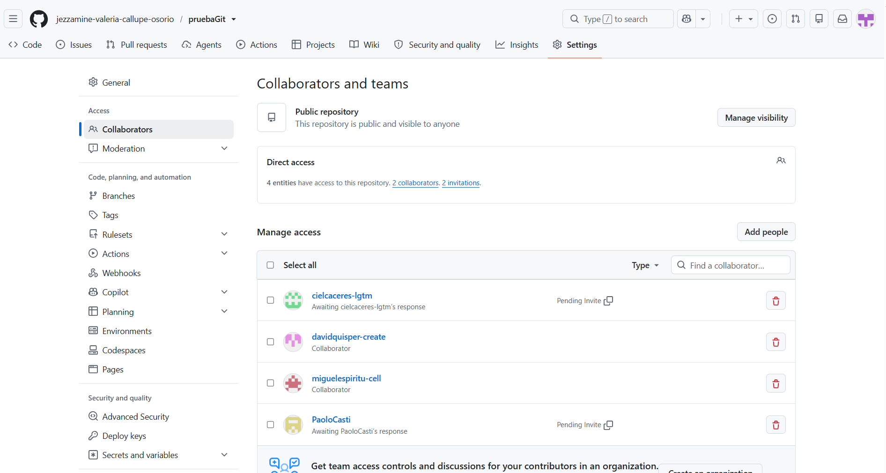

<div align="center">

  <h1 align="center" style="color: #2E6EEF; font-weight: bold;">
    🚀 Equipo 04 - PROCESOS DE INNOVACION EN INGENIERIA
  </h1>


  <p><b>Facultad de Ciencias e Ingeniería</b><br>
  <i>Universidad Peruana Cayetano Heredia (UPCH) • 2026-2</i></p>


  </p>

</div>

---

## 🌍 Descripción del Equipo

Somos el **Equipo 04** del curso *Procesos de Innovación (2026-2)*, conformado por un grupo multidisciplinario de estudiantes de la **Universidad Peruana Cayetano Heredia**. Nuestro objetivo principal es integrar la ingeniería, el análisis de datos y la tecnología para concebir soluciones tangibles a problemas reales, aplicando metodologías de diseño centrado en el usuario.

Nos enfocaremos en generar impacto a través de los siguientes **Objetivos de Desarrollo Sostenible (ODS)**:

* **ODS 3:** Salud y Bienestar — *Monitoreo y diagnóstico preventivo.*
* **ODS 9:** Industria, Innovación e Infraestructura — *Desarrollo de tecnología con hardware abierto.*
* **ODS 11:** Ciudades y Comunidades Sostenibles — *Optimización de recursos e impacto local.*
* **ODS 12:** Producción y Consumo Responsables — *Sostenibilidad de materiales y procesos.*

💡 **Líneas y propuestas de proyecto:**
* **Sistema de monitoreo ambiental descentralizado:** Red de sensores de bajo costo para control comunitario de variables críticas.
* **Plataforma de diagnóstico preventivo de salud:** Dispositivo portable para alertas tempranas mediante procesamiento de datos.
* **Optimización de recursos mediante IoT:** Automatización y gestión eficiente de servicios básicos en entornos urbanos o rurales.

---

## 👥 Integrantes del Equipo

| Nombre | Rol | Intereses & Especialidad |
| :--- | :---: | :--- |
| **Caceres Tenorio Ciel Jamile** | 🔍 Analista de Datos | Programación, arquitectura de software, analítica y simulación. |
| **Castillo Juarez Paolo Yazid** | 👨‍💻 Gestor Git & Dev | Desarrollo técnico, innovación social y gestión de repositorios. |
| **Callupe Osorio Jezzamine Valeria** | 🎨 Diseñadora UX/UI | Investigación de usuario, sostenibilidad y gestión ambiental. |
| **Miguel Angel Espiritu Huaman** | ⚙️ Arquitecto Hardware | Diseño de circuitos, prototipado electrónico e integración técnica. |
| **David Alejandro Quispe Reyes** | 📄 Lider de Redacción | Redacción técnica, comunicación científica y control de calidad. |

---

## 📌 Resumen Final

## 🛠️ Instalación y Uso

1. **Clonar el repositorio:**
   ```bash
   git clone https://github.com/jezzamine-valeria-callupe-osorio/pruebaGit.git
Este README reúne nuestra identidad como equipo, nuestras motivaciones técnicas y la Hoja de Ruta para desarrollar un prototipo funcional durante el ciclo 2026-1. Combinamos rigor académico, creatividad técnica y un compromiso constante con el impacto social.

## 📸 Evidencias del Proyecto














